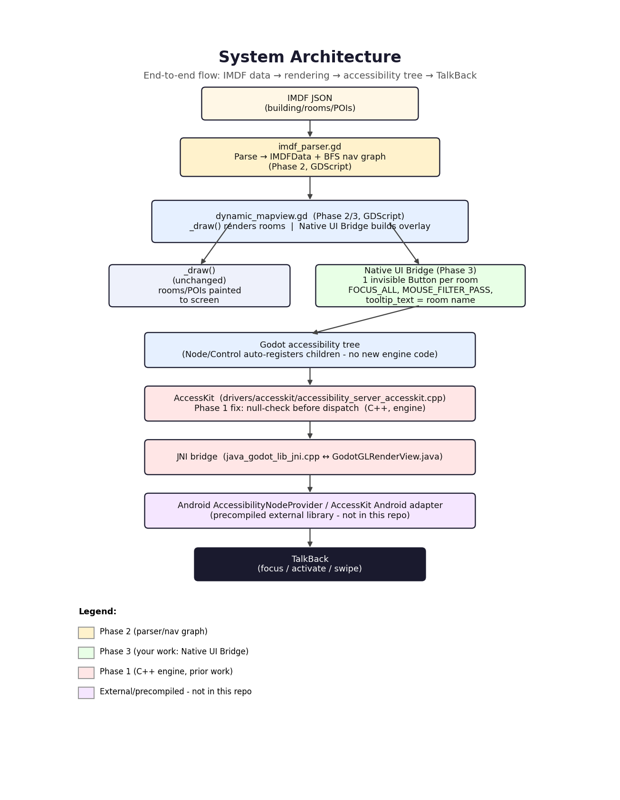

# TalkBack + IMDF Accessibility Bridge for Godot Engine

A Godot 4 addon that bridges a dynamically rendered indoor map (IMDF — Indoor Mapping Data Format)
to Android's native accessibility framework, so **Android TalkBack** can navigate and activate
map rooms using standard accessibility actions instead of custom gesture detection.

> Developed as an academic project undertaken as part of the **Samsung PRISM** program. See
> [LICENSE](./LICENSE) — this repository is public for portfolio and demonstration purposes; it is
> not released under a permissive open-source license.

## The problem this solves

The map is drawn as raw pixels — rectangles, polygons, text — using Godot's low-level 2D drawing
API (`_draw()`). Screen readers have no visibility into pixels; they can only see real UI nodes
that the OS accessibility framework knows about. Without a bridge, a blind user pointed at a
beautifully rendered indoor map would hear nothing at all.

## The fix

An invisible layer of real `Button` nodes is placed exactly on top of each rendered room —
invisible to sighted users, but fully visible to Android's accessibility framework, so TalkBack can
focus each room, read its name aloud, and activate it, while the pixels underneath are drawn
exactly as before.

## Architecture

- **`imdf_parser.gd`** — parses IMDF JSON into typed data, builds a navigation graph, and finds
  accessible routes between rooms via BFS.
- **`dynamic_mapview.gd`** — the main `Control`. `_draw()` renders rooms/POIs (unchanged, pixel
  rendering). The **Native UI Bridge** builds and synchronizes an invisible accessibility overlay
  alongside it.
- **`talkback_gesture_handler.gd`** — a prototype gesture-based screen-reader simulator, kept for
  editor/non-Android testing and automatically bypassed when a real screen reader is detected.
- **`dynamic_3d_accessibility_bridge.gd`** — a second, independent bridge that brings the same
  invisible-overlay approach to 3D scenes (see [3D Accessibility Bridge](#3d-accessibility-bridge)
  below).
- **`test_native_accessibility_validation.gd`** — a white-box validation suite that calls the same
  handler functions Android's native accessibility actions invoke, directly.

Rendering and accessibility are two parallel systems, kept in sync by re-using the exact same
zoom/pan transform math — accessibility is never derived from pixels, and pixels are never derived
from the accessibility tree.

See [`addons/talkback_imdf_system/IMPLEMENTATION_GUIDE.md`](addons/talkback_imdf_system/IMPLEMENTATION_GUIDE.md)
for the full technical design, and [`docs/engine-fix.md`](docs/engine-fix.md) for the Phase 1
engine-level context this addon depends on.

## Key design decisions

| Decision | Why |
|---|---|
| Invisible `Button` overlay parallel to `_draw()` | Keeps the existing, verified rendering pipeline completely untouched; accessibility is additive, not a rewrite. |
| Accessibility node creation order follows the IMDF navigation graph (BFS), with a geometric fallback | Verified directly from Godot's engine source that Android's accessibility traversal follows scene-tree child order, not `focus_neighbor_*` (which only drives keyboard/gamepad navigation). |
| Validation suite calls handler functions directly instead of simulating touch/gesture input | Real TalkBack bypasses Godot's `InputEvent` pipeline entirely (native `ACTION_FOCUS`/`ACTION_CLICK`), so simulating input events would test a path TalkBack doesn't actually use. |
| BFS for route-finding | Unweighted graph, small room counts — gives the shortest hop-count route without the added complexity of Dijkstra/A*. |

## 3D Accessibility Bridge

The 2D `DynamicMapView` bridge overlays invisible `Button`s at fixed 2D room rectangles. It has no
notion of a camera, so it can't track a moving/rotating 3D scene. `dynamic_3d_accessibility_bridge.gd`
(`Dynamic3DAccessibilityBridge`) extends the same invisible-overlay technique to that case:

- **`register_target(unit_id, node, tooltip, aabb)`** — registers any `Node3D` (optionally with a
  custom `AABB`) as an accessible target; falls back to the node's own `VisualInstance3D.get_aabb()`
  or a small default bounding box if none is given.
- **Per-frame screen projection** — every frame, each target's `AABB` corners are projected to 2D
  screen space via `Camera3D.unproject_position()`, and the invisible `Button` overlay is resized
  and repositioned to the resulting bounding rectangle. `Camera3D.is_position_behind()` disables and
  hides the button for anything off-screen or behind the camera, so the accessibility overlay stays
  correct as the camera moves, rotates, or orbits.
- **Minimum touch target size** — projected rectangles are padded up to at least 44×44 pixels, a
  standard minimum accessible touch-target size, even if the 3D object projects to something smaller
  on screen.
- **Traversal order** — targets are sorted by projected screen position (top-to-bottom, then
  left-to-right) every frame, and the overlay `Button`s are reordered in the scene tree (plus
  `accessibility_flow_to_nodes` reassigned) to match — reusing the same "scene-tree order is what
  Android's accessibility tree actually reads" principle established for the 2D bridge, but
  recomputed continuously since a 3D camera can change what's on-screen and in what order at any time.
- **`test_3d_accessibility_scene.gd`** — a demo scene with an orbiting camera and three registered
  3D rooms, useful for visually confirming the overlay tracks correctly as the camera moves.
- **`test_3d_accessibility_validation.gd`** — white-box tests covering target registration, button
  properties, projection/alignment against the camera's own `unproject_position()`, off-screen
  disabling, traversal ordering, `flow_to` linking, signal propagation, and cleanup — following the
  same direct-handler-call testing approach as the 2D validation suite.

This is a separate, opt-in component — it does not replace or modify `DynamicMapView` or the IMDF
2D pipeline; a project can use either bridge independently depending on whether its accessible
content is 2D or 3D.

## Running it

1. Open this folder as a project in the **official Godot 4.7 Stable Editor**.
2. Confirm the plugin **TalkBack + IMDF System** is enabled under *Project → Project Settings → Plugins*.
3. Open and run `map_view_test.tscn`.
4. In the Editor, `Tab`/`Shift+Tab` move accessibility focus forward/backward between rooms (this
   uses the same scene-tree order mechanism Android's accessibility tree relies on); `Enter`
   activates the focused room.

## Validation

Three explicitly separated validation tiers were used, since a Samsung embedded MapView / physical
device environment was not available during development:

1. **Code-level** — verified by direct source inspection (this addon's GDScript and the relevant
   Godot engine C++).
2. **Editor-level** — the addon running inside the official Godot 4.7 Stable Editor: correct node
   creation, correct properties, correct signal behavior, Tab/Shift+Tab/Enter interaction, no
   drift after zoom/pan/resize/reload.
3. **Android runtime** — real TalkBack gesture behavior, spoken announcements, and the AccessKit
   Android adapter's internal traversal logic were **not verified on a physical device** and would
   require Samsung's embedded environment to confirm.

Run `addons/talkback_imdf_system/test/test_native_accessibility_validation.gd` (attach it to a bare
`Node` in a scene and run it) for the automated, code-level validation suite.

## Repository scope

This repository contains only the addon and the minimal Godot project needed to run it — it is not
a fork of the Godot Engine source tree. A small, prior fix to Godot's own C++ AccessKit driver
(Phase 1 of this project) is documented, not redistributed, in [`docs/engine-fix.md`](docs/engine-fix.md).

## License

See [LICENSE](./LICENSE). All rights reserved — published for demonstration and portfolio purposes.
